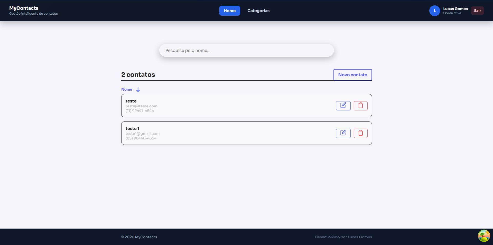
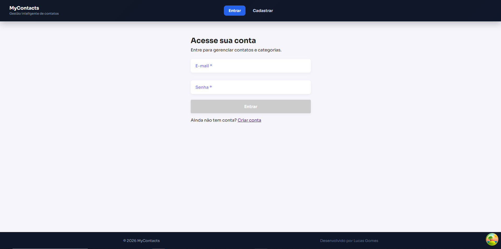
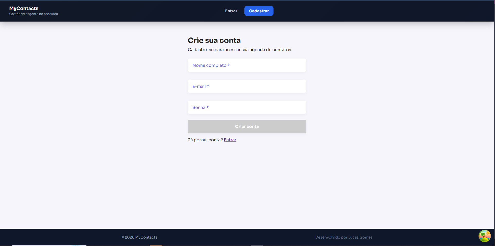
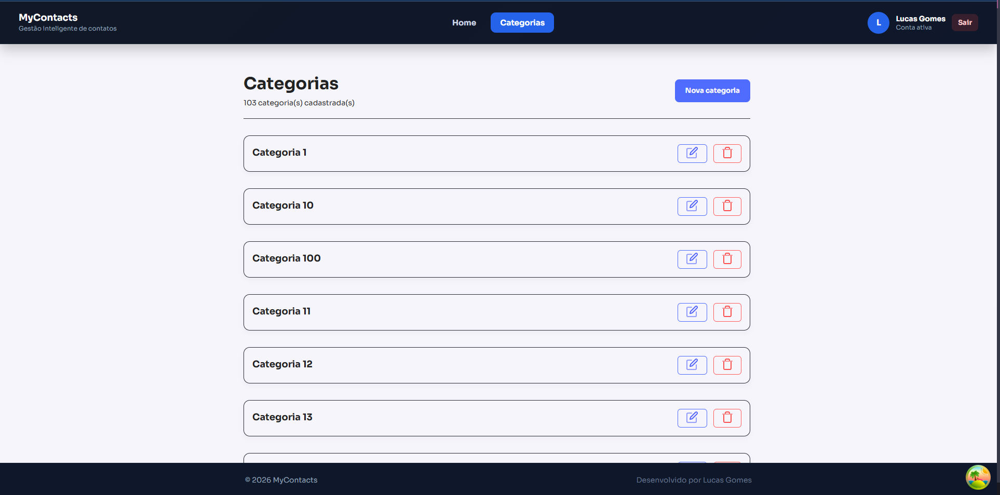
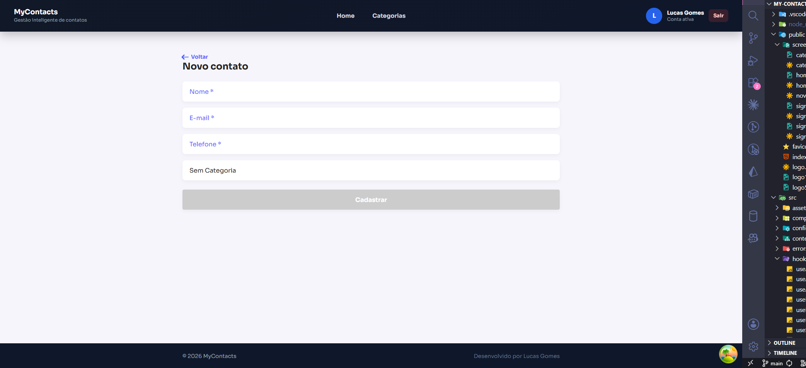
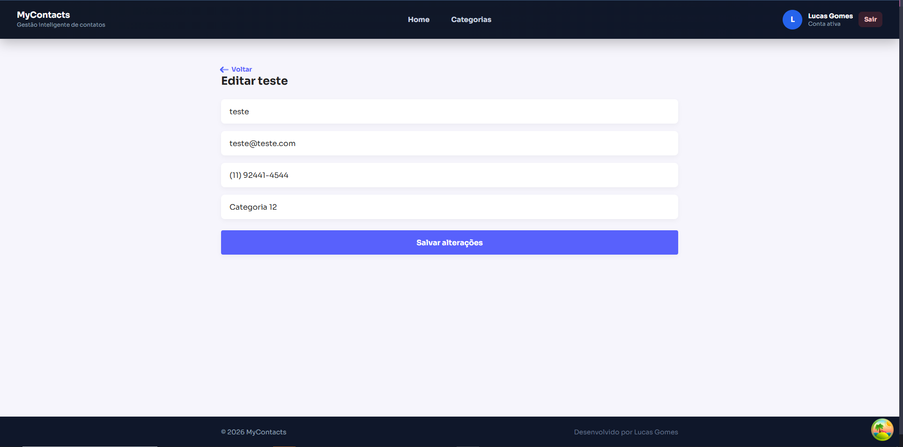
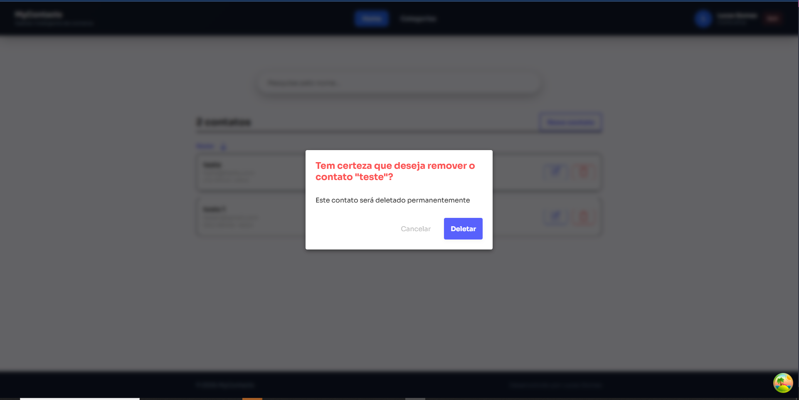

# MyContacts Frontend

Aplicação frontend para gerenciamento de contatos e categorias, desenvolvida com React, com foco em organização de código, experiência de uso e boas práticas de desenvolvimento frontend.

O projeto conta com autenticação, refresh token, paginação, busca, feedback visual via toasts e integração com API REST.


## Visao Geral

O **MyContacts Frontend** foi desenvolvido como uma aplicação moderna para gestão de contatos, buscando uma estrutura simples, escalável e de fácil manutenção.
A arquitetura do projeto segue uma separação clara de responsabilidades:

- `pages`: composicao de telas da aplicação
- `components`: componentes reutilizaveis e formulários
- `hooks`: regras de estado, efeitos e comportamentos reutilizáveis
- `services`: integracao com API
- `contexts`: gerenciamento de estados globais, como autenticação
- `utils`: funções utilitárias, validações, formatações e configurações auxiliares

## Funcionalidades

- Cadastro de usuários
- Login com autenticação
- Refresh token para renovação de sessão
- Persistência de sessão no `localStorage`
- Proteção de rotas autenticadas
- Listagem de contatos
- Busca de contatos
- Paginação de resultados
- Cadastro, edição e exclusão de contatos
- Gerenciamento de categorias
- Feedback visual com mensagens toast
- Integração com API REST
- Tratamento de respostas `401 Unauthorized`

## Stack Tecnica

- React 19
- React Router DOM 7
- React Query (TanStack Query) 5
- Styled Components 6
- Axios
- ESLint
- Create React App (react-scripts)

## Requisitos

- Node.js 18+
- npm 9+

## Configuracao de Ambiente

Arquivo `.env`:

```env
DISABLE_ESLINT_PLUGIN=true
REACT_APP_API_URL=http://localhost:3001
WDS_SOCKET_PORT=0
```

Variaveis principais:

- `REACT_APP_API_URL`: URL base da API backend

## Como Executar

1. Instale dependencias:

```bash
npm install
```

2. Inicie o projeto em desenvolvimento:

```bash
npm start
```

3. Acesse no navegador:

`http://localhost:3000`

## Scripts Disponiveis

- `npm start`: inicia a aplicacao em modo desenvolvimento
- `npm run build`: gera build de producao em `build/`
- `npm test`: executa os testes
- `npm run eject`: expoe configuracoes do CRA (irreversivel)

## Autenticacao

Fluxo implementado:

- Cadastro: `POST /auth/signup`
- Login: `POST /auth/signin`
- Refresh token: `POST /refresh-token`

Tokens e dados de sessao sao persistidos no `localStorage` via chaves em `src/config/storageKeys.js`.

O `AuthContext` é responsável por:

- armazenar os dados do usuário autenticado;
- controlar login e logout;
- injetar o header Authorization: Bearer <token> nas requisições autenticadas;
- ignorar o header de autorização em rotas públicas de autenticação;
- tentar renovar a sessão automaticamente ao receber respostas 401 Unauthorized, quando existir refresh token válido.

## Estrutura de Pastas (Resumo)

```text
src/
├── components/
├── config/
├── contexts/
├── hooks/
├── pages/
├── services/
└── utils/
```

## Screenshots

A pasta `public/screenshots` contem imagens de exemplo para deixar o README mais visual.
Substitua os arquivos pelos screenshots reais sem mudar os nomes, assim os links abaixo continuam funcionando.

### Home



### Sign In



### Sign Up



### Categorias



### Novo Contato



### Editar Contato



### Excluir Contato



## Qualidade e Padroes

Alguns pontos aplicados no projeto:

- separação de responsabilidades por camadas;
- componentes reutilizáveis para formulários e interface;
- regras de estado centralizadas em hooks;
- validações por campo utilizando useErrors;
- comunicação com API isolada em services;
- configuração centralizada do Axios;
- autenticação gerenciada via contexto global;
- tratamento de sessão expirada com refresh token;
- código organizado para facilitar manutenção e evolução.

## Infra Local (Opcional)

Existe `docker-compose.yml` com PostgreSQL para ambiente local:

```bash
docker compose up -d
```

Observacao: o frontend depende de uma API em `http://localhost:3001`.

## Troubleshooting

- Erro `401 Unauthorized` no cadastro/login:
  - confirme se os endpoints da API de auth estao ativos
  - limpe `localStorage` do navegador para remover tokens antigos
  - verifique `REACT_APP_API_URL`

- CORS no navegador:
  - habilite o frontend (`http://localhost:3000`) no backend

- Porta em uso:
  - altere a porta da API ou encerre o processo conflitando
 
## Melhorias Futuras

Algumas evoluções possíveis para o projeto:

- adicionar testes unitários para hooks e componentes;
- melhorar cobertura de testes para autenticação;
- criar paginação mais avançada com infinite scroll;
- adicionar loading skeletons;
- melhorar tratamento global de erros;
- documentar melhor a API backend utilizada;
- adicionar pipeline de CI/CD;
- adicionar deploy em ambiente cloud.

## Contribuicao

1. Crie uma branch de feature
2. Faça commits pequenos e descritivos
3. Abra PR com contexto da alteracao, impacto e como testar

## Licenca

Definir conforme a politica do repositorio.
